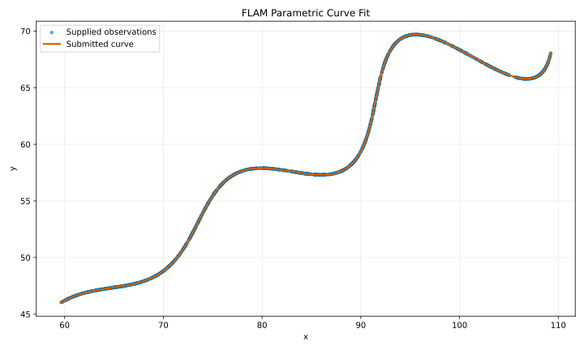

# FLAM R&D / AI Assignment

## Parametric Curve Parameter Estimation

This repository estimates the unknown parameters $\theta$, $M$, and $X$ of the supplied parametric curve from 1,500 unordered $(x,y)$ observations.

## Submission answer

The recovered parameters are:

$$
\boxed{\theta=30^\circ=\frac{\pi}{6}\text{ radians},\qquad M=0.03,\qquad X=55}
$$

Substituting them into the original equation gives, for $6<t<60$:

$$
\begin{aligned}
x(t)
&=t\cos\left(\frac{\pi}{6}\right)
-e^{0.03|t|}\sin(0.3t)\sin\left(\frac{\pi}{6}\right)+55,\\[4pt]
y(t)
&=42+t\sin\left(\frac{\pi}{6}\right)
+e^{0.03|t|}\sin(0.3t)\cos\left(\frac{\pi}{6}\right).
\end{aligned}
$$

### Desmos verification

[Open the final curve in Desmos](https://www.desmos.com/calculator/dnm1sdkavp)

Copy-paste expression:

```text
\left(t\cos\left(\frac{\pi}{6}\right)-e^{0.03\left|t\right|}\sin(0.3t)\sin\left(\frac{\pi}{6}\right)+55,\ 42+t\sin\left(\frac{\pi}{6}\right)+e^{0.03\left|t\right|}\sin(0.3t)\cos\left(\frac{\pi}{6}\right)\right)\left\{6<t<60\right\}
```



## Problem statement

The supplied points lie on the curve

$$
\begin{aligned}
x&=t\cos(\theta)-e^{M|t|}\sin(0.3t)\sin(\theta)+X,\\
y&=42+t\sin(\theta)+e^{M|t|}\sin(0.3t)\cos(\theta),
\end{aligned}
$$

with the constraints

$$
0^\circ<\theta<50^\circ,
\qquad -0.05<M<0.05,
\qquad 0<X<100,
\qquad 6<t<60.
$$

The input is [`data/UVCE_BTech_Flam_Resource.csv`](data/UVCE_BTech_Flam_Resource.csv), containing 1,500 observations. Their file order is not assumed to correspond to increasing $t$.

## Method

Define

$$
A(t)=e^{M|t|}\sin(0.3t).
$$

After translating the observations by $(X,42)$, the curve becomes a rotation:

$$
\begin{bmatrix}
x-X\\
y-42
\end{bmatrix}
=
\begin{bmatrix}
\cos\theta&-\sin\theta\\
\sin\theta&\cos\theta
\end{bmatrix}
\begin{bmatrix}
t\\
A(t)
\end{bmatrix}.
$$

Applying the inverse rotation gives, for every observation $(x_i,y_i)$:

$$
\begin{aligned}
t_i&=(x_i-X)\cos\theta+(y_i-42)\sin\theta,\\
v_i&=-(x_i-X)\sin\theta+(y_i-42)\cos\theta.
\end{aligned}
$$

For the correct parameters,

$$
v_i=e^{M|t_i|}\sin(0.3t_i).
$$

Therefore, the fitting residual is

$$
r_i=v_i-e^{M|t_i|}\sin(0.3t_i),
$$

and the numerical search minimizes

$$
L_{\mathrm{fit}}(\theta,M,X)
=\frac{1}{N}\sum_{i=1}^{N}|r_i|.
$$

The implementation uses bounded SciPy differential evolution with seed 42. This global three-parameter search avoids fitting an independent value of $t$ for every observation.

## Assignment metric

The fitting residual above is the optimization objective. The assignment evaluator instead uses pointwise two-dimensional L1 distance between expected and predicted curves at identical, uniformly sampled values of $t$:

$$
L_{\mathrm{curve}}
=\frac{1}{K}\sum_{j=1}^{K}
\left(
|x_{\mathrm{pred}}(t_j)-x_{\mathrm{expected}}(t_j)|
+|y_{\mathrm{pred}}(t_j)-y_{\mathrm{expected}}(t_j)|
\right).
$$

The hidden expected curve is unavailable locally. The code implements the same uniform pointwise formula to compare the numerical fit with the clean submitted parameters as a stability check.

## Numerical results

| Parameter | Numerical fit | Submitted value |
|---|---:|---:|
| $\theta$ | $29.9999730015^\circ$ | $30^\circ=\pi/6$ |
| $M$ | $0.0299999971$ | $0.03$ |
| $X$ | $54.9999983399$ | $55$ |

Validation across all supplied observations:

| Check | Result |
|---|---:|
| Observations used | 1,500 |
| Inferred $t$ range | 6.0494044746 to 59.9951670058 |
| Fitted mean transformed absolute residual | $2.558593110992\times10^{-6}$ |
| Fitted maximum transformed absolute residual | $1.745866859326\times10^{-5}$ |
| Submitted-value mean transformed absolute residual | $1.504827005253\times10^{-5}$ |
| Submitted-value maximum transformed absolute residual | $4.051144748252\times10^{-5}$ |
| Uniform curve L1, numerical fit versus submitted curve | $1.946108109428\times10^{-5}$ |

The numerical solution is extremely close to the clean values $30^\circ$, $0.03$, and $55$. The small difference is consistent with decimal rounding in the supplied observations. The program revalidates the rounded values and requires the fitted-versus-submitted uniform curve L1 difference to remain below $10^{-3}$.

## Reproduce the result

Python 3.12 is used by the automated workflow.

```bash
python -m venv .venv
source .venv/bin/activate
python -m pip install -r requirements.txt
MPLBACKEND=Agg python solution.py
```

Run the tests with:

```bash
python -m unittest discover -s tests -v
```

The program resolves default paths relative to `solution.py`, so it can be launched from any working directory. Available options are:

```text
--data PATH
--output-dir DIR
--validation-samples N
--show
```

The deterministic run generates:

- `results/fitted_parameters.txt`
- `results/curve_plot.svg`

## Repository structure

```text
.
|-- data/
|   `-- UVCE_BTech_Flam_Resource.csv
|-- results/
|   |-- curve_plot.svg
|   `-- fitted_parameters.txt
|-- tests/
|   `-- test_solution.py
|-- .github/workflows/test.yml
|-- README.md
|-- requirements.txt
`-- solution.py
```

## References

- [Final Desmos visualization](https://www.desmos.com/calculator/dnm1sdkavp)
- [SciPy `differential_evolution` documentation](https://docs.scipy.org/doc/scipy/reference/generated/scipy.optimize.differential_evolution.html)
